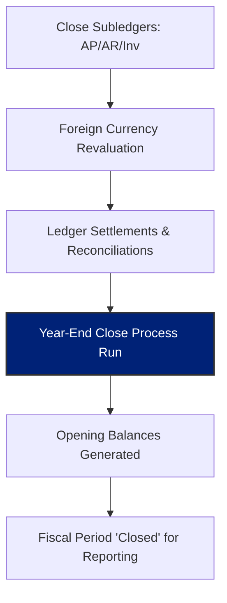

## 📉 Featured Project: Multi-Entity Year-End Close Optimization
**Industry Archetype:** Global Manufacturing Group (10+ Legal Entities)  
**Core Modules:** General Ledger, Consolidation, Intercompany Accounting

### 🎯 The Challenge
The client faced a bottleneck during the annual financial close, often exceeding a 15-day window. Primary issues included unresolved intercompany variances and manual adjustments required for Retained Earnings due to master data inconsistencies in Main Account classifications.

### 🛠️ The Functional Solution
I re-engineered the Year-End closing workflow by focusing on **Proactive Data Integrity** and automated reconciliation within D365FO.

**Key Functional Milestones:**
* **Pre-Close Audit Framework:** Established a mandatory review process for Main Account classifications (Balance Sheet vs. P&L) and Retained Earnings mapping to ensure "Right-First-Time" Opening Transactions.
* **Ledger Settlements:** Configured automated ledger settlement rules to clear technical clearing accounts, reducing manual reconciliation effort by 60%.
* **Foreign Currency Management:** Standardized the **Realized/Unrealized Gain/Loss** calculation logic across all entities to ensure consolidated reporting accuracy.

#### 🔄 Year-End Process Sequence

### 📈 The Business Impact
* **Speed:** Reduced the total year-end closing window from 15 days to 5 days.
* **Accuracy:** Eliminated year-over-year opening balance discrepancies through precise Main Account type validation.
* **Compliance:** Provided a clean, repeatable audit trail for external auditors regarding intercompany eliminations and currency revaluations.

### 💡 Expert Note: Resilience & Recovery
* In alignment with best practices, I configured the 'Reverse Year-End Close' templates. This allows for a controlled reversal and re-run if post-closing adjustments are required by auditors, ensuring the system remains the "Single Source of Truth" without manual SQL corrections.
---
